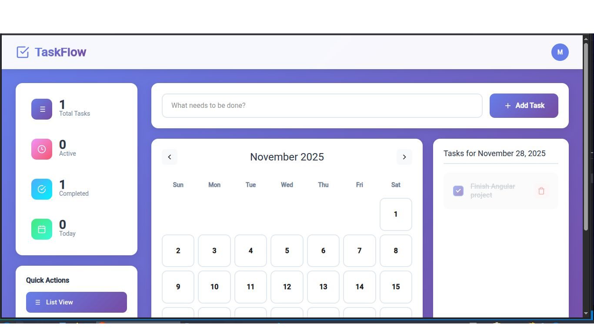

# TaskFlow - Full Stack Todo Application

A modern, feature-rich todo application built with **Angular 19** frontend and **Flask** backend, featuring JWT authentication, calendar views, and a beautiful UI.

  



## ✨ Features

- 🔐 **JWT Authentication** - Secure user registration and login
- 📋 **Todo Management** - Create, update, toggle, and delete todos
- 📅 **Calendar View** - Visualize todos by date with an interactive calendar
- 📊 **Dashboard Stats** - Track total, active, completed, and today's tasks
- 🎨 **Modern UI** - Clean, responsive design with smooth animations
- 👤 **User Profile** - Update username and password
- 🔍 **Filter Options** - View all, active, or completed tasks
- 📱 **Responsive Design** - Works seamlessly on desktop and mobile

## 🏗️ Architecture

### Backend (Flask)
- **Framework**: Flask 3.0+
- **Database**: SQLite with SQLAlchemy ORM
- **Authentication**: JWT tokens with Flask-JWT-Extended
- **Password Hashing**: Bcrypt
- **CORS**: Flask-CORS for cross-origin requests

### Frontend (Angular)
- **Framework**: Angular 19
- **UI Components**: Standalone components
- **Styling**: Custom CSS with modern design
- **HTTP Client**: Angular HttpClient for API calls
- **Routing**: Angular Router with auth guards
- **Notifications**: Material Snackbar

## 📁 Project Structure

```
project/
├── server/
│   ├── app.py              # Flask application & API endpoints
│   ├── seed.py             # Database seeding script
│   └── todo.db             # SQLite database (auto-generated)
│

└── src/
      └── app/
            ├── components/
            │   ├── login/      # Login/Register component
            │   └── todos/      # Main dashboard component
            ├── services/
            │   ├── login.ts    # Authentication service
            │   ├── todos.ts    # Todo CRUD service
            │   └── user.ts     # User profile service
            ├── models/
            │   ├── type.login.ts
            │   └── type.todos.ts
            ├── auth-guard.ts   # Route protection
            └── AuthService.ts  # Auth state management
```

## 🚀 Getting Started

### Prerequisites

- **Python 3.8+**
- **Node.js 18+** and npm
- **Angular CLI 19**

### Backend Setup

1. **Navigate to server directory**:
   ```bash
   cd server
   ```

2. **Create virtual environment**:
   ```bash
   python -m venv venv
   source venv/bin/activate  # On Windows: venv\Scripts\activate
   ```

3. **Install dependencies**:
   ```bash
   pip install flask flask-cors flask-sqlalchemy flask-migrate flask-bcrypt flask-jwt-extended
   ```

4. **Initialize database**:
   ```bash
   flask db init
   flask db migrate -m "Initial migration"
   flask db upgrade
   ```

5. **Seed database** (optional):
   ```bash
   python seed.py
   ```

6. **Run server**:
   ```bash
   python app.py
   ```
   Server runs on `https://taskflow-azrb.onrender.com`

### Frontend Setup


1. **Install dependencies**:
   ```bash
   npm install
   ```

2. **Install Angular Material** (for snackbar):
   ```bash
   ng add @angular/material
   ```

3. **Run development server**:
   ```bash
   ng serve
   ```
   Application runs on `http://localhost:4200`

## 🔌 API Endpoints

### Authentication
- `POST /users` - Register new user
- `POST /login` - Login user (returns JWT token)

### User Management
- `GET /users` - Get all users
- `PUT /users/:id` - Update user (protected)
- `DELETE /users/:id` - Delete user (protected)

### Todo Operations
- `POST /todos` - Create todo (protected)
- `GET /todos` - Get user's todos (protected)
- `PUT /todos/:id` - Update todo (protected)
- `PATCH /todos/:id` - Partially update todo (protected)
- `DELETE /todos/:id` - Delete todo (protected)

### Authentication Headers
Protected routes require JWT token:
```
Authorization: Bearer <your_jwt_token>
```

## 💾 Database Schema

### Users Table
```sql
- id (Integer, Primary Key)
- username (String, Unique)
- password (String, Hashed)
```

### Todos Table
```sql
- id (Integer, Primary Key)
- content (String)
- completed (Boolean)
- created_at (DateTime)
- updated_at (DateTime)
- user_id (Foreign Key → users.id)
```

## 🎯 Key Features Explained

### Authentication Flow
1. User registers/logs in
2. Backend returns JWT token + user info
3. Token stored in localStorage
4. Token sent with every protected API request
5. Auth guard protects routes on frontend

### Todo Management
- **List View**: Filter by all/active/completed
- **Calendar View**: See todos organized by date
- **Toggle Complete**: Click checkbox to mark done
- **Delete**: Confirmation modal prevents accidents
- **Stats**: Real-time counters for task metrics

### Security Features
- Password hashing with Bcrypt
- JWT token expiration (24 hours)
- Protected API routes
- Frontend route guards
- User-specific data isolation

## 🎨 UI Components

### Login/Register Page
- Toggle between login and register forms
- Input validation
- Error handling with snackbar notifications

### Dashboard
- **Header**: Logo, user avatar with dropdown
- **Sidebar**: Statistics cards and quick actions
- **Main Area**: Todo input, filter tabs, todo list
- **Calendar**: Month navigation, date selection, task indicators

### Profile Modal
- Update username
- Change password
- Persists changes to backend

## 🔧 Configuration

### Backend Configuration (app.py)
```python
app.config['SQLALCHEMY_DATABASE_URI'] = 'sqlite:///todo.db'
app.config['JWT_SECRET_KEY'] = 'super-secret'  # Change in production!
```

### Frontend Configuration
Update API base URL in services if needed:
```typescript
// Default: https://taskflow-azrb.onrender.com
```

## 🧪 Testing

### Seed Data
The `seed.py` script creates test users:
- **Username**: samuel, **Password**: password123
- **Username**: jane, **Password**: securepass
- **Username**: john, **Password**: mypassword

## 📝 Usage Tips

1. **First Time Setup**: Register a new account or use seeded credentials
2. **Adding Todos**: Type in the input field and press Enter or click "Add Task"
3. **Filtering**: Use tabs to quickly view active/completed tasks
4. **Calendar**: Click dates to see tasks for specific days
5. **Profile**: Click avatar → "Update Profile" to change credentials
6. **Logout**: Click avatar → "Logout"

## 🚨 Common Issues

### CORS Errors
- Ensure Flask-CORS is installed and configured
- Check frontend is calling correct backend URL

### JWT Token Issues
- Token expires after 24 hours - re-login required
- Ensure token is properly stored in localStorage

### Database Errors
- Run migrations: `flask db upgrade`
- Delete `todo.db` and re-initialize if corrupted

## 🔒 Security Considerations

**⚠️ For Production:**
1. Change `JWT_SECRET_KEY` to a strong random string
2. Use environment variables for sensitive config
3. Enable HTTPS
4. Add rate limiting
5. Implement refresh tokens
6. Add input sanitization
7. Use PostgreSQL/MySQL instead of SQLite

## 📦 Dependencies

### Backend
```
Flask==3.0+
Flask-CORS
Flask-SQLAlchemy
Flask-Migrate
Flask-Bcrypt
Flask-JWT-Extended
```

### Frontend
```
@angular/core: 19.x
@angular/common: 19.x
@angular/forms: 19.x
@angular/material: 19.x
```

## 🤝 Contributing

1. Fork the repository
2. Create feature branch (`git checkout -b feature/AmazingFeature`)
3. Commit changes (`git commit -m 'Add AmazingFeature'`)
4. Push to branch (`git push origin feature/AmazingFeature`)
5. Open Pull Request

## 📄 License

This project is open source and available under the [MIT License](LICENSE).

## 👨‍💻 Author

**Samuel Gitau**


**Happy Task Managing! 📝✨**
